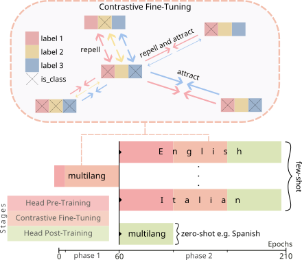

# mCPT at SemEval-2023 Task 3: Multilingual Label-Aware Contrastive Pre-Training of Transformers for Few- and Zero-shot Framing Detection

> Alexander Ertl  
> Markus Reiter-Haas  
> Kevin Innerhofer  
> Elisabeth Lex  

This repository contains the code for the paper: mCPT at SemEval-2023 Task 3: Multilingual Label-Aware Contrastive Pre-Training of Transformers for Few- and Zero-shot Framing Detection ([TODO: Link to paper once published]()).

TLDR: Our system (mCPT) employs a pre-training procedure based on multilingual Transformers using a label-aware contrastive loss function to tackle the SemEval-2023 Task 3 Subtask Framing Detection.  
The challenge of the shared task lies in identifying a set of 14 frames when only a few or zero samples are available, i.e., a multilingual multi-label few- or zero-shot setting.  
Therein, we exploit two features of the task: (i) multi-label information and (ii) multilingual data for pre-training.  
We are first on the Spanish framing prediction [leaderboard](https://propaganda.math.unipd.it/semeval2023task3/SemEval2023testleaderboard.html).



Our contributions are:
- C1: We adopt a multi-label contrastive loss function for natural language processing to optimize the embeddings of textual data.
- C2 We describe a two-phase multi-stage training procedure for multilingual scenarios with limited data, i.e., few- and zero-shot predictions.
- C3 We demonstrate the effectiveness of our winning system for framing detection supported by embedding and ablation studies.

The pretrained model is available at [HuggingFace organization page](https://huggingface.co/socialcomplab)

Model usage:
```python
from transformers import AutoModel, AutoTokenizer
tokenizer = AutoTokenizer.from_pretrained("sentence-transformers/paraphrase-multilingual-MiniLM-L12-v2")
model = AutoModel.from_pretrained("socialcomplab/mcpt-body-semeval2023task3")
print(model(**tokenizer("Test sentence.", return_tensors="pt")))
```

The basic repository structure mirrors the paper sections.  
`mcpt` provides the basic components for re-usability.  
